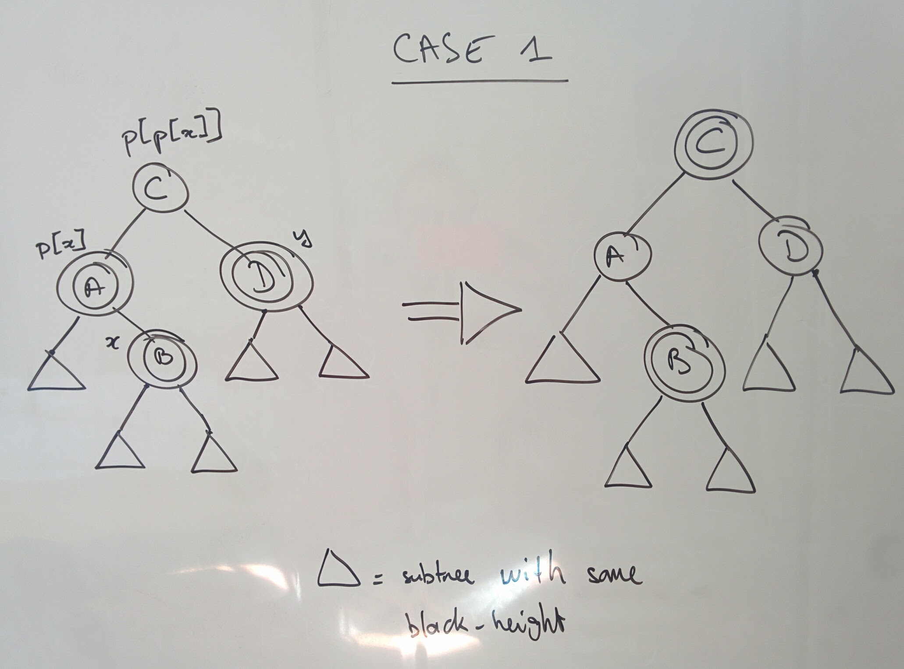
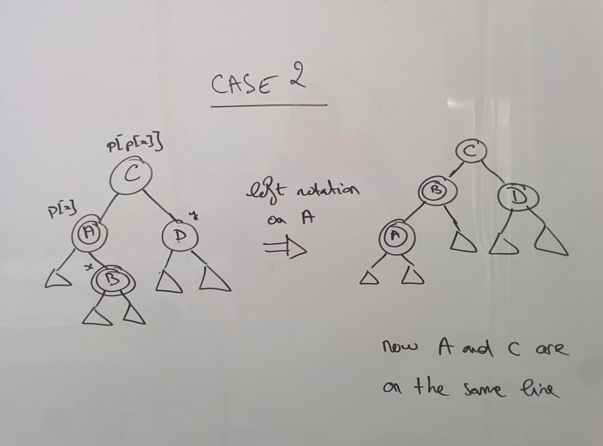
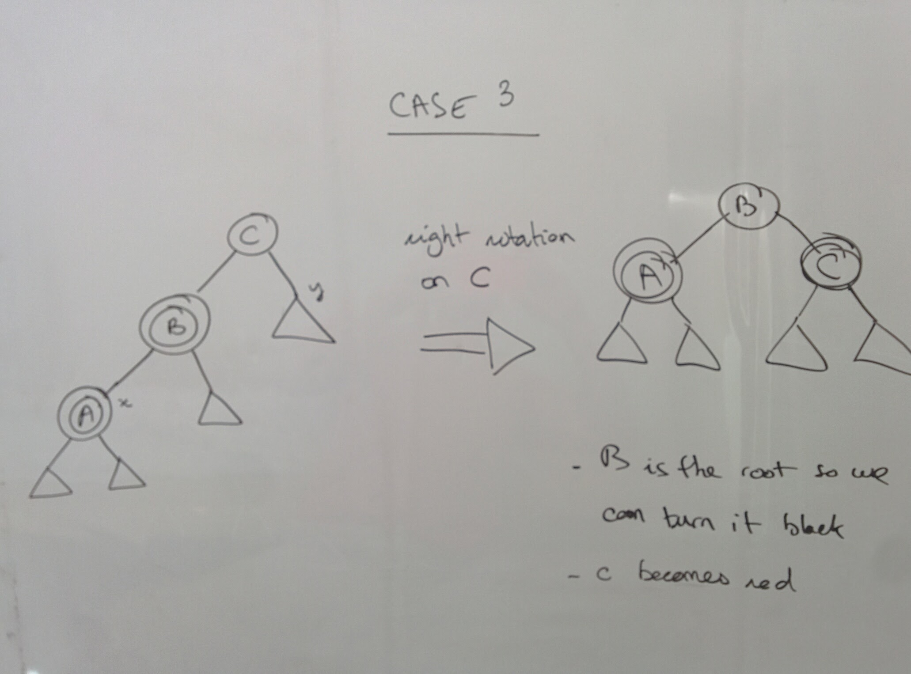

# Balanced Binary Tree

Source: 
- [Coursera Algorithms and Design Part 1](https://www.coursera.org/learn/algorithm-design-analysis/lecture/juAOg/balanced-search-trees-operations-and-applications)
- [Mit Open Course](https://www.youtube.com/watch?v=iumaOUqoSCk)

## Why using is a Binary Search Tree?

A Binary Search Tree is a **dynamic version of a sorted array** supporting **Insertions** and **Deletions**.

Example:
```
[3, 6, 10, 11, 17, 23, 30, 36] 
```

| Operations on Sorted Array | Running Time |
| --- | --- |
| Search | O(log(n)) |
| Select | O(1) |
| Min/Max | O(1) |
| Pred/Succ | O(1) |
| Rank (keys <= to a given value) | O(log(n)) |
| Output in sorted order| O(n) |

But what about **Insertions** and **Deletion** (would take O(n) and not acceptable)? Raison d'être of a Binary Tree is to implement all the operations of a sorted array + insertions and deletions in log(n).

| Operations on Binary Tree | Running Time |
| --- | --- |
| Search | O(log(n)) |
| Select | O(log(n)) |
| Min/Max | O(log(n)) |
| Pred/Succ | O(log(n)) |
| Rank (keys <= to a given value) | O(log(n)) |
| Output in sorted order | O(n) |
| Insert | O(log(n)) |
| Delete | O(log(n)) |

If you don't need insertions and deletions then use a sorted array.

## Binary Search Tree Basics

### Structure

**Basic Example:**
```
     3
   /   \
  1     5
   \   /
    2 4 
```

**Basic Structure:**
- exacty one node per key
- basic version has 3 pointers per node:
    - left node
    - right node
    - one to the parent 

**Search Tree Property:**

For every single node with a key X:
- all the keys stored in its left subtree must be less than X
- all the keys stored in its right subtree must be bigger than X

### Height of a BST

Note: many possibles trees for a set of keys
```
     3                 5
   /   \              /
  1     5            4
   \   /            /
    2 4            3
                  /
                 2
                /
               1
```

Note: height could be anywhere from ~log(n) to n-1

### BST Operations

**Search for key k in tree T:**
- start at the root
- traverse left/right child pointers as needed:
    - if the k < key at current node than recurse in the left subtree
    - if the k > key at current node than recurse in the right subtree
- return node with key k or NULL, as appropriate 

**Insert a new key k into a tree T:**
- search for k (unsuccesfully)
- rewire finall NULL pointer to point to new node with key k
- handle duplicates with convention like duplicates go on the left subtree

The worst-case running time for Search (or Insert) operation in a BTS containing n keys is O(height).

**Compute the Min/Max:**
- start at root
- follow left child pointer until you can't anymore 
- return last key found

**Compute the Predecessor of key k:**
- easy case: if k's left subtree nonempty, return max key in left subtree.
- otherwise: follow parent pointer until you get to a key less than k
- flip left to right for successor

**Print key in increasing order with order traversal (running time is O(n)):**
- left r = root of search tree, with subtrees T<sub>L</sub> and T<sub>R</sub>
- recurse on T<sub>L</sub>
- print r's key
- recurse on T<sub>R</sub>

**Deletion a key k from a tree T:**
- search for k
- Easy case (k's node has no children):
    - just delete k's node from tree, done
- Medium case (k's node has one child)
    - just "splice out" k's node (unique child assumes position previously held by k's node)
- Difficult (k's node has two childrens):
    - compute k's predecessor l
    - swap k and l (in its new position, k has no right child)
    - delete k
    - O(heigth)

Idea: store extra information at each node about the tree itself. Example of augmentation can be storing the size of the tree at each node. Be carreful with augmentation because insertions and deletion may require to update a lot of nodes.

**Select i<sup>th</sup> order statistic from augmented search tree with subtree size (O(n)):**
- start at root x, with children y and z
- let a = size(y)
- if a = i-1 return x's key
- if a >= i recuresively compute i<sup>th</sup> order statistic of search tree rooted at y
- if a < i -1 recursely compute (i - a - 1)th order statistic of search tree rooted at z

## Red-Black Tree

The height of the tree cannot be better of log(n). Balanced search tree ensures that height always O(log(n)). Other balanced tree include are ACL tree, 2-3 trees, Slay tree, B-trees, Skip list, Treaps...

### Red-Black Invariants:

1. each node is red or black 
2. the root of the search tree is black
3. no 2 reds in a row. red node => only black children
4. every root-null path has same number of black nodes

Claim: a chain of length 3 cannot be a red-black tree

Claim: every red-black tree with n nodes has height <= 2 x log(n+1)

If every root-null path has >= k nodes, the tree includes (at the top) a perfectly balanced search tree of depth - 1 => size n of the tree must be at least 2<sup>k</sup> - 1

``` 
size n >= 2^k - 1, where k = mininum number of nodes on root-null path
k <= log(n+1)
```

Thus: in a Red-Black tree with n nodes, there is a root-null path with at most log(n+1) black nodes.

### Rotations

Rotation is a key primitive used by all balanced tree implementations. The goal is to rewire a few nodes and rebalance a search tree without violating the tree property. Running time is constant.

Two kind of rotations: left and right rotations. In either case, when you invoke a rotation it's on a parent-child pair of nodes and the goal is to invert the relationship (the parent becomes the child and the child becomes the parent:
- left rotation: right child of the parent
- right rotation: left child of the parent

Left rotation of a parent X and right child Y: 
```
     |                     |
     X                     Y
    / \                   / \
   A   Y         =>      X   C  
      / \               / \
     B   C             A   B
```

Right rotation is the invert of the a left rotation

### Insertion in a Red-Black Tree

High-Level plan:
- do the insertion like the tree is a normal BTS
    - if we colored x red then we can break the 3<sup>nd</sup> invariant
    - if we colored x black then we can break the 4<sup>th</sup> invariant
- restore the invariants:
    - flipping the colors
    - left/right rotations

We choose the lesser of two evils and we color x in red (3<sup>nd</sup> invariant is local and easier to handle than the 4<sup>th</sup> invariant which is global). We have several cases:
- x's parent y is black, done
- else y is red (which involves that y has a black parent w):
    - case 1: w has another child z and it's red: in that case we flipping the color of z, y and w (z and y becomes black and w becomes black). The 4<sup>th</sup> invariant is preserved and we make progress on the 3<sup>nd</sup> invariant. However, w's parent could be red which would violate the 3<sup>nd</sup> invariant. In that case we propagate the double-red node upward until we reach the root. This can end up in 3 ways:
        - w's parent is red, done
        - we reach the root when we just color the red root in black (it doesn't break the 4<sup>th</sup> invariant since all root-null path go through the root)
        - case 2
    - case 2: w had another child z and it's black: we that case we'll have to use rotations and recolorings but are a couple of subcases.

### Insertion Algorithm

source: [Mit Open Course](https://www.youtube.com/watch?v=iumaOUqoSCk)

```
RB-Insert(T, X):
    tree-insert(T, X)
    color[X] = RED
    while X != root[T] and color[X] = RED:
        // CASE A: if parent of X is left child of great-parent of X 
        if p[X] = left(p[p[X]]):
            Y = right(p[p[X]]) // right child of the great-parent
            if color[Y] = RED:
                <case 1>
            elif X = right[p[X]]:
                <case 2>
                <case 3>
        else: // CASE B
            same as A reversing the notion of left and right 

        X = p[p[x]]

    color[root] <- BLACK
```

case 1: 
case 2: 
case 3: 

